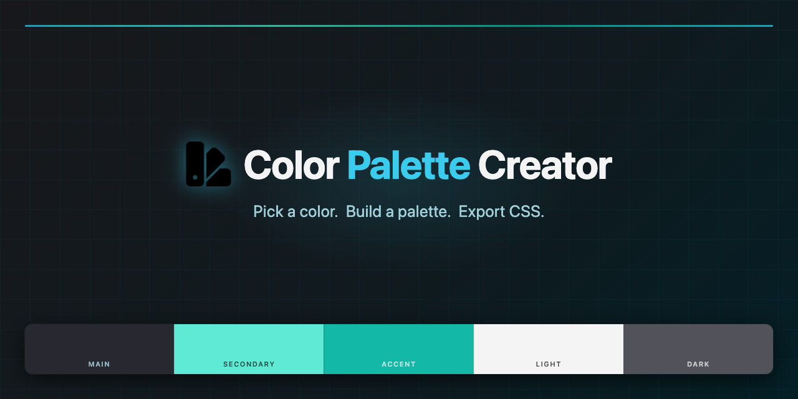

# Palette Creator

### V 1.0.0

A fun little color palette tool for designers and developers. Pick a base color,
explore variations built on color theory, fine-tune each slot, preview the
result live on the UI, and export it as CSS variables — all in one place.

Visit:
**[palette-creator.rogerioromao.dev](https://palette-creator.rogerioromao.dev/)**

---

## How to use it

### Getting started

_TLDR: Pick a color, build a palette with the variations and fine-tuning, test
it on the UI, and export it as CSS variables. Or just keep hitting the
`One shot` button and see what comes up, it's fun._

The app comes with a dark theme and a light theme. Switch it at the top right,
or let it follow your system preference. Either way, the palette you build is
independent of the app's theme. The way it works is both the builtin themes and
the generated palettes use the same CSS custom properties. So when you generate
a pallete and want to see how it could look in a real app, just hit the **Test
this palette** button and it will apply to the app itself. You can also set the
text color light or dark for your palette to check contrast and readability.

A random palette is automatically generated when the app loads. It is not
automatically applied to the UI, you're still seeing the app's default theme for
your preferred dark/light theme. If you then press the **Test this palette**
button, the random palette will be applied to the UI. You can also hit the
**Reset site colors** button to go back to the default look.

Other than completely random like this, you can also start with a specific color
of your choice. The idea is you only need to pick one color, and the app will
build a whole palette based on it. Which you can then modify and fine-tune as
much as you like, with the variations panel and the individual HSL sliders for
each slot.

### Get a base color

You can pick a color in a few ways.

- **One Shot** — generates a random color, builds a full scheme, and applies it
  to the UI in one click. Great for quick inspiration, and the main way i use
  it. This is the most fun way to use the app and see a lot of different
  palettes in a short time. Just keep hitting the button and see what comes up.
  This is the only way to generate a random palette and apply it to the UI in
  one click.

- **Random** button — picks a random base color and regenerates all the color
  variations from it. These variations are shown in the Variations panel, but
  they are not applied to the UI. You can pick and choose which ones to apply by
  clicking them and then clicking a palette slot to paste them. The variations
  are created based on several color theory rules, such as complementary,
  analogous, triadic, tints, shades, and more. So you get a nice range of
  related colors to work with.
- **Inputs** — enter a color in HEX, RGB, or HSL. All three are always in sync,
  so you can work in whichever format you prefer. There's also a color wheel
  picker. This is the most precise way to start with a specific color in mind.
  You can enter the exact color you want, and then explore variations based on
  it.

Setting a new main color resets everything, all the color slots of the palette
get wiped except for the base color, which is the one you just set. So if you
like the palette you have, make sure to save it before setting a new base color,
otherwise you'll lose all the work you did on the variations and fine-tuning.

### Build your palette

Once you have a base color, the **Variations** panel shows a range of related
colors.

- Click a variation to copy it, then click any palette slot to paste it.
- Click a selected variation again to deselect it.
- Hit **Random Variations** to randomize all slots at once. This means that all
  the color slots in the palette will be filled with one of the variations from
  the panel, filling those slots in if they are empty, or replacing the colors
  in those slots if they are already filled. There is logic to try to come up
  with suitably semantic colors from the variations to the different palette
  slots, for example lightness checks to try to assign darker colors to the
  "dark" slots and lighter colors to the "light" slots, and other fallbacks, but
  it's something I still want to improve.

### Fine-tune

Each palette slot has its own H / S / L sliders for precise adjustments. You can
also:

- Click the format pill (HEX / HSL / RGB) below a slot to cycle through display
  formats, that just shows the color value in different formats, but doesn't
  change the actual color. This is just for your convenience, so you can see the
  color value in the format you prefer.
- Click a slot's label to rename it — useful when you're building a design
  system. This will be used when you export (copy to clipboard) the palette, for
  naming the CSS custom properties in a way that makes sense for your project.
  For example, if you rename the "primary" slot to "brand", when you export the
  palette, instead of getting `--clr-primary` in the CSS, you'll get
  `--clr-brand`. This is just a naming convention for your own use, it doesn't
  affect how the app works internally.

### Preview

- **Test this palette** — applies your palette to the app itself so you can see
  how the colors work in a real UI context. This is not a 1-1 representation of
  how the palette would look in your project, since the app has its own design
  and components, not all the 5 colors are used in the same proportion and in
  some cases we are using color-mix where the actual colors are blended, but
  it's a good way to get a general sense of how the colors work together and how
  they look in a UI.
- **Reset site colors** — brings the app back to its default look. This button
  highlights itself when you have a custom palette applied, so it's easy to find
  and go back to the default look if you want to start over or compare.
  Sometimes due to the random colors created, the contrast can be very low and
  the text can become unreadable, so this button is a quick way to reset and get
  back to a usable state.
- **Light Text / Dark Text** — sets the text color for your scheme so you can
  check readability. Every palette has a light and dark color slot, once you
  apply the palette to the UI, you can switch between light and dark text to see
  how the contrast works with your colors. This is especially useful when you
  have a palette with low contrast, so you can quickly check if the text is
  still readable or if you need to adjust the colors.
- The sun / moon icon in the nav switches the app between its own light and dark
  mode, independently of your palette.

### Export and save

- **Export CSS** — copies your palette as CSS custom properties, ready to paste
  into your project.
- **Save Palette** — name and store the palette in your browser's local storage.
  No account needed. All your saved palettes appear on its own panel and can be
  reloaded or deleted at any time. Reloading means it will apply the palette to
  the UI so you can see it and work with it, or export its values from the
  'Export CSS' button, but it won't apply it to the app UI until you hit the
  **Test this palette** button.

---

### Next planned features

- Make the algorithm that assigns the variations to the palette slots smarter,
  so it tries to assign more suitable colors to each slot based on their
  characteristics, such as lightness, saturation, and hue. It already does this
  to some extent, but I want to improve it further to create more harmonious
  palettes with the random variations button.

## AI usage

Yes, AI assistance was used in the final stages of this project, primarily for a
complete UI overhaul and refining certain features and bugs. The original
project was built manually years ago with 90%+ of the functionality already
present, but the UI was very amateur. My workflow was: human in the loop at
every stage: assigning tasks, approving work manually, iterating on plans for
bigger features, and finishing with a manual refactoring and clean-up pass. It
was fun, AI has improved a lot the last few months, and it took days to put the
app on a level of polish that would have taken weeks or months for me to achieve
manually for a side project.

## Run locally

If you want to, clone this repo, cd into it, and:

```bash
pnpm install
pnpm dev
```
